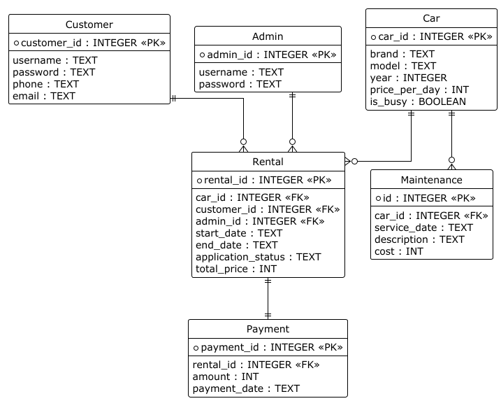

# DriveTime

Система учёта аренды автомобилей.
Проект реализован на Python и предназначен для автоматизации работы компании по аренде автомобилей.
Система позволяет клиентам регистрироваться, бронировать автомобили с симуляцией оплаты, просматривать и отменять заявки, а также оплачивать штрафы. Администраторам предоставлены инструменты для управления автопарком, обработки заявок, отметки выдачи/возврата и добавления записей обслуживания (включая штрафы за повреждения).

---

## Описание проекта

**DriveTime** — это консольная информационная система, предназначенная для учёта и управления процессами аренды автомобилей.
Система автоматизирует следующие процессы:

- Регистрацию и авторизацию клиентов и администраторов;
- Оформление заявок клиентами с проверкой доступности и симуляцией оплаты по СБП (QR-код);
- Управление автопарком администратором (добавление, удаление, редактирование автомобилей);
- Обработку заявок (подтверждение, отклонение, отметка выдачи/возврата);
- Фиксацию обслуживания и штрафов (с привязкой к аренде);
- Контроль состояний и статусов аренды, предотвращение двойных бронирований.

Работа с системой осуществляется через **консольный интерфейс Python**. База данных — SQLite (файл drivetimedb.sqlite).

---

## Цели проекта

- Автоматизировать процесс бронирования автомобилей.  
- Обеспечить администратору удобные инструменты для управления автопарком и заявками.  
- Исключить двойные бронирования и ошибки учёта.  
- Упростить взаимодействие между клиентами и администраторами, включая обработку штрафов и платежей.

---

## Пользователи системы

**Клиент**:
- Регистрируется с вводом ФИО, телефона, email, паспорта и водительского удостоверения. 
- Авторизуется и просматривает список доступных автомобилей.
- Создаёт заявки на аренду с выбором дат и симуляцией оплаты.  
- Просматривает свои заявки и их статусы (ожидание, подтверждена, выдана, возвращена, отклонена).
- Отменяет заявку (только в статусе "ожидание").
- Просматривает и оплачивает штрафы (за повреждения при возврате).

**Администратор**:
- Регистрируется и авторизуется.
- Добавляет, удаляет и редактирует автомобили.
- Просматривает заявки клиентов.
- Подтверждает или отклоняет заявки.
- Отмечает выдачу и возврат автомобилей, с опцией фиксации повреждений и штрафов.
- Добавляет записи обслуживания (ремонт или штрафы) для автомобилей.

---

## Основные функции

**Функции клиента:**
- Регистрация и авторизация.
- Просмотр списка доступных автомобилей.
- Создание заявок с проверкой дат, расчётом цены и симуляцией оплаты.
- Отмена заявок (до подтверждения).
- Просмотр своих заявок и их статусов.
- Просмотр и оплата штрафов (с симуляцией платежа).

**Функции администратора:**
- Регистрация и авторизация.
- Добавление, удаление и редактирование автомобилей в базе.
- Просмотр заявок клиентов.  
- Подтверждение или отклонение заявок.  
- Отметка выдачи и возврата автомобилей (с обновлением статуса машины).
- Добавление записей обслуживания (штрафы или ремонт, с привязкой к аренде).

---

## Основные сущности системы
- Автомобиль (id, марка, модель, год, цена_в_сутки, is_busy)
- Клиент (id, username, password, full_name, phone, email, passport, driver_license)
- Заявка (id, клиент_id, автомобиль_id, admin_id, дата_начала, дата_окончания, status, total_price)
- Администратор (id, username, password)
- Обслуживание (id, автомобиль_id, дата_обслуживания, описание, стоимость, rental_id, is_paid)
- Платёж (id, rental_id, сумма, дата_платежа)

---

## Архитектура

Проект реализован по принципу **трёхуровневой архитектуры (Layered Architecture)**:

1. **Presentation Layer (Интерфейс)** — консольное меню Python (ввод действий пользователем).  
2. **Business Logic Layer (Бизнес-логика)** — функции обработки заявок, проверки доступности машин, изменения статусов.  
3. **Data Layer (Слой данных)** — хранение информации в базе данных (SQLite или PostgreSQL).  

---
## Диаграмма Use Case

---

## Flowchart — основные бизнес-процессы

---
## Диаграмма Er

---
