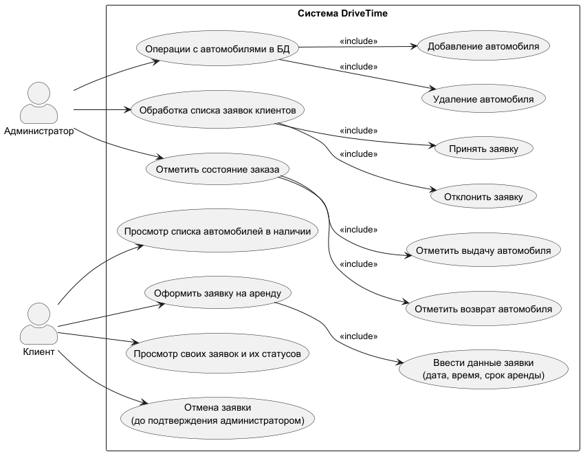
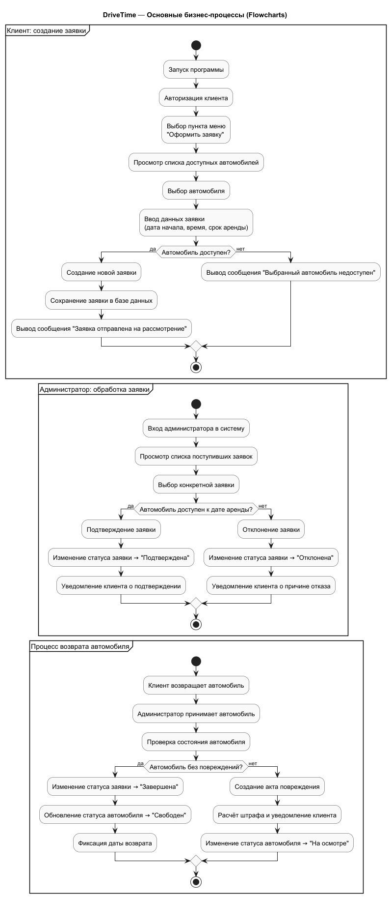

# DriveTime

Система учёта аренды автомобилей.  
Проект реализован на Python и предназначен для автоматизации работы компании по аренде автомобилей.  
Система позволяет клиентам бронировать автомобили, а администраторам — управлять автопарком и заявками.

---

## ? Описание проекта

**DriveTime** — это консольная информационная система, предназначенная для учёта и управления процессами аренды автомобилей.  
Система автоматизирует следующие процессы:
- оформление заявок клиентами;
- управление автопарком администратором;
- контроль состояния и статуса аренды.

Работа с системой осуществляется через **консольный интерфейс Python**.

---

## ? Цели проекта

- Автоматизировать процесс бронирования автомобилей.  
- Обеспечить администратору удобные инструменты для управления автопарком и заявками.  
- Исключить двойные бронирования и ошибки учёта.  
- Упростить взаимодействие между клиентами и администраторами.

---

## ? Пользователи системы

**Клиент**:
- Просматривает список доступных автомобилей.  
- Создаёт заявки на аренду.  
- Просматривает свои заявки и их статусы.  
- Может отменить заявку (до подтверждения администратором).  

**Администратор**:
- Добавляет и удаляет автомобили.  
- Просматривает все заявки клиентов.  
- Подтверждает или отклоняет заявки.  
- Отмечает выдачу и возврат автомобилей.  

---

## ?? Основные функции

**Функции клиента:**
- Просмотр списка доступных автомобилей.  
- Создание и отмена заявок.  
- Просмотр своих заявок и их статусов.  

**Функции администратора:**
- Добавление и удаление автомобилей из базы.  
- Просмотр всех заявок клиентов.  
- Подтверждение или отклонение заявок.  
- Отметка факта выдачи и возврата автомобиля.  

---

## ? Основные сущности системы
- Автомобиль (id, марка, модель, статус, цена_в_сутки)
- Клиент (id, ФИО, телефон, email)
- Заявка (id, клиент_id, автомобиль_id, дата_начала, дата_окончания, статус)
- Администратор (id, имя, логин)

---

## ? Архитектура

Проект реализован по принципу **трёхуровневой архитектуры (Layered Architecture)**:

1. **Presentation Layer (Интерфейс)** — консольное меню Python (ввод действий пользователем).  
2. **Business Logic Layer (Бизнес-логика)** — функции обработки заявок, проверки доступности машин, изменения статусов.  
3. **Data Layer (Слой данных)** — хранение информации в базе данных (SQLite или PostgreSQL).  

---
## ? Диаграмма Use Case

---

## ? Flowchart — основные бизнес-процессы

---
